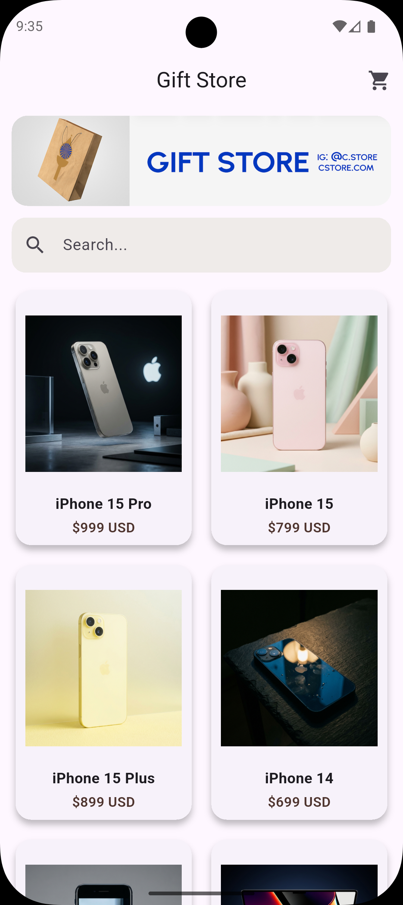
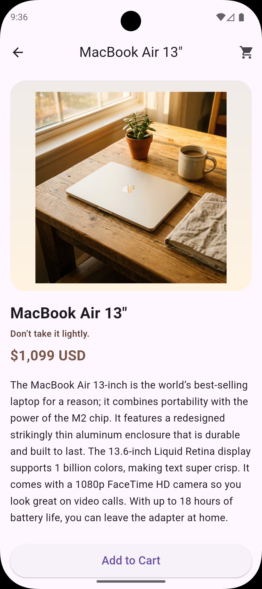
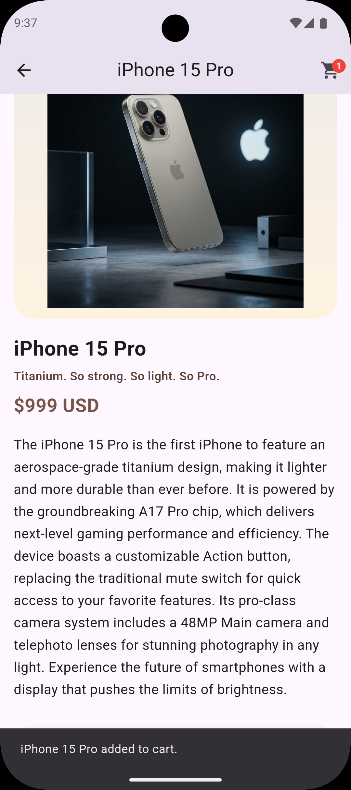
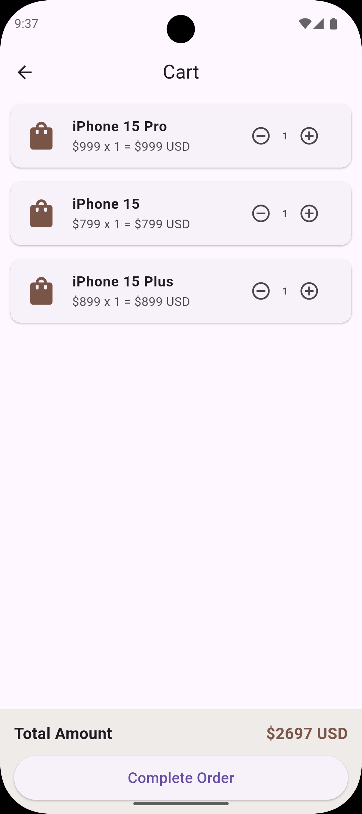
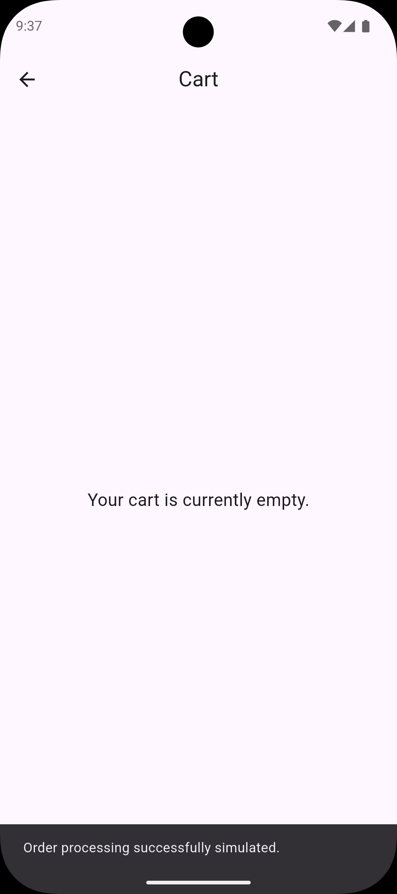

# Mini Catalog

A  Mini Catalog Flutter App.

This project is a Flutter-based mobile application developed during my Software Development Internship at Software Persona as part of a mobile application development training program focused on building Android and iOS apps with Flutter.

The application demonstrates fundamental Flutter concepts including UI layout, product listing using GridView, page navigation, search functionality, asset image usage, and basic state management.

---

## Features

- Product catalog displayed using GridView
- Product detail page
- Page navigation using Navigator
- Search functionality
- Add to cart simulation
- Product image assets
- Clean Material UI design

---

## Technologies Used

- Flutter
- Dart
- Material UI Widgets

---

## Flutter Version

Flutter 3.41.3

---

## How to Run

1. Clone the repository

git clone https://github.com/alihantasyurek/Mini_Catalog_Flutter.git

2. Navigate to the project folder

cd Mini_Catalog_Flutter

3. Install dependencies

flutter pub get

4. Run the application

flutter run

Make sure Flutter SDK is installed and properly configured.

## Screenshots

### Home Page

### Product Detail Page

### Add to Cart

### The Cart

### Order Completion

